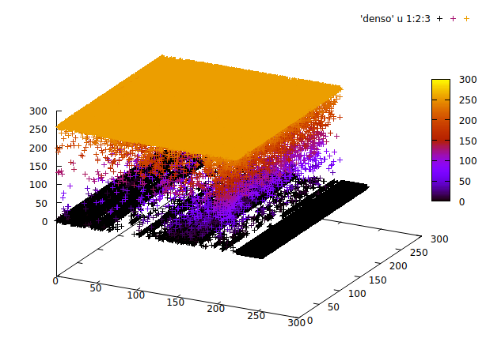

# Sobol and other statistical scans of the internet
Many projects make scans of the entire internet to count the number of
servers for certain protocols, or how these servers behave.

In contrast, this program attempts to not scan the entire internet, but
by making use of statistics, arrive at useful numbers with a minimal amount
of traffic.

This makes it possible to make frequent statistics without alarming amounts
of traffic



## Compiling
Requires a somewhat recent C++ compiler. Then do:

```
git submodule update --init --recurse
```

To get two dependencies, and then run `make`.

## Prefixes file
In order to be up to date, the tool needs a list of announced prefixes.

A sample file `prefixes` is provided in the `sample` directory.  It can also
be generated like this from `bird` if you have a BGP feed:

```
# birdc show route primary | tail -n +2 | cut -f1 -d" " > prefixes
```

# Tools
`dnsscan` scans a tiny part of the internet for nameservers & open
resolvers. 

`makemap` maps the internet.

## dnsscan
`dnsscan` is run like this:

```
dnsscan samples/prefixes
```
It then sends out 100,000 packets to random and sub-random internet
addresses, and writes out the results to four files:

 * sobplot, Sobol random IP addresses: queries responses response-percentage
 * rndplot, random IP addresses: queries responses response-percentage
 * comboplot, sum of the two files above: queries responses response-percentage
 * oresplot, open resolvers from top-2 scans: queries open-resolvers open-percentage

## Making the internet map
`makemap` reads the prefixes and turns them into a 3D plot in a file called
`denso`. The format of this file is 'first-octet second-octet /24-count'.
Every /16 can contain at most 256 /24s.

Sample use:

```
$ ./makemap sample/prefixes
Have 704562 netmasks
2851277568 IPv4 addresses announced (66.3865%)
Writing data to file 'denso'

$ gnuplot
gnuplot> splot 'denso' u 1:2:3 palette
```

